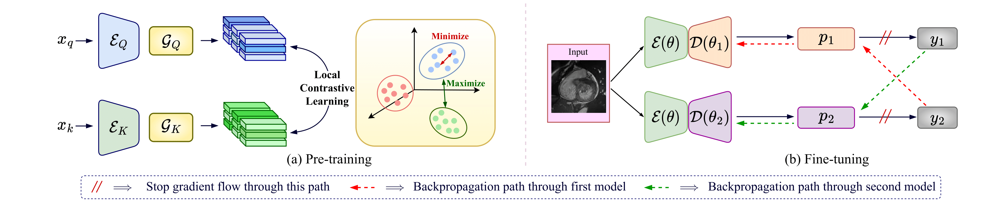

## IDEAL: Improved DEnse LocAL Contrastive Learning for Semi-Supervised Medical Image Segmentation, ICASSP 2023

***Note:*** **Polished code coming soon!**

Hritam Basak*, Soumitri Chattopadhyay*, Rohit Kundu*, Sayan Nag*, Rammohan Mallipeddi, [**"IDEAL: Improved DEnse LocAL Contrastive Learning for Semi-Supervised Medical Image Segmentation"**](https://arxiv.org/abs/2210.15075), _IEEE Intl. Conf. on Acoustics, Speech and Signal Processing_ **(ICASSP)**, 2023.

[Project Page](https://rohit-kundu.github.io/IDEAL-ICASSP23/) | [arXiv](https://arxiv.org/abs/2210.15075)



## Abstract
Due to the scarcity of labeled data, Contrastive Self-Supervised Learning (SSL) frameworks have lately shown great potential in several medical image analysis tasks. However, the existing contrastive mechanisms are sub-optimal for dense pixel-level segmentation tasks due to their inability to mine local features. To this end, we extend the concept of metric learning to the segmentation task, using a dense (dis)similarity learning for pre-training a deep encoder network, and employing a semi-supervised paradigm to fine-tune for the downstream task. Specifically, we propose a simple convolutional projection head for obtaining dense pixel-level features, and a new contrastive loss to utilize these dense projections thereby improving the local representations. A bidirectional consistency regularization mechanism involving two-stream model training is devised for the downstream task. Upon comparison, our IDEAL method outperforms the SoTA methods by fair margins on cardiac MRI segmentation.

## Citation
If you find this article useful in your research, consider citing us:
```
@inproceedings{basak2023ideal,
    author = {Hritam Basak and Soumitri Chattopadhyay and Rohit Kundu and Sayan Nag and Rammohan Mallipeddi},
    title = {IDEAL: Improved DEnse LocAL Contrastive Learning for Semi-Supervised Medical Image Segmentation},
    booktitle = {IEEE International Conference on Acoustics, Speech and Signal Processing (ICASSP)},
    year = {2023}
}
```
